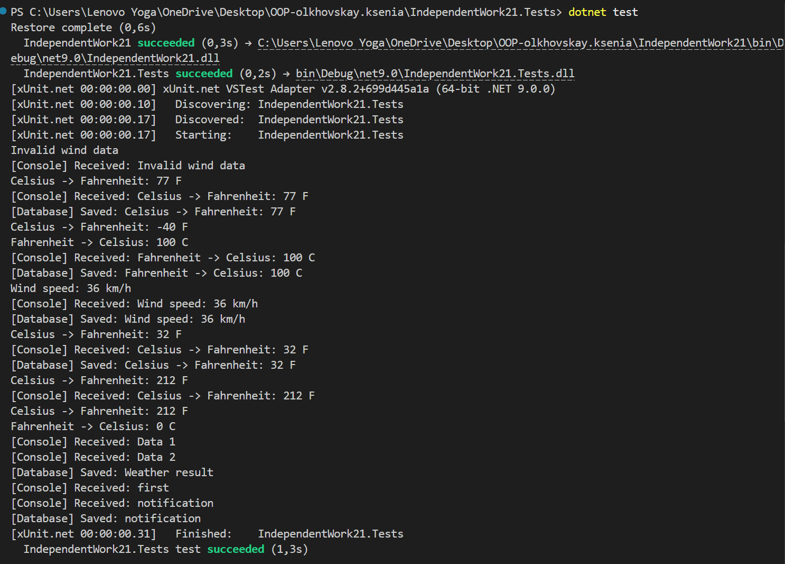

# Самостійна робота 21

## Тема

Інтеграційні тести патернів Factory, Singleton, Strategy та Observer.

## Опис рішення

Проєкт моделює обробку погодних даних:

- `StrategyFactory` створює потрібну стратегію обробки за типом.
- `DataContext` виконує поточну strategy та дозволяє змінити її під час виконання.
- `ProcessingService` об'єднує strategy, singleton-стан і observer-сповіщення.
- `AppState` зберігає останній результат як singleton.
- `DataPublisher`, `ConsoleOutputObserver` і `WeatherDatabaseObserver` реалізують observer-сценарій.

## Інтеграційні сценарії

| No | Сценарій | Очікуваний результат | Фактичний результат |
|---:|---|---|---|
| 1 | Factory створює Celsius strategy, сервіс обробляє дані, singleton і observers отримують результат | `25 C` перетворюється у `77 F`; `AppState`, console observer і database observer містять однаковий результат | Перевірено тестом `Positive_FactoryStrategyServiceSingletonObserver_CelsiusScenario` |
| 2 | Runtime-зміна strategy з Fahrenheit на Wind | Перший результат: `100 C`, другий: `36 km/h`; singleton зберігає останній результат; observers отримують події у правильному порядку | Перевірено тестом `Positive_RuntimeStrategyChange_UpdatesStateAndNotifiesObserversInOrder` |
| 3 | Factory приймає тип strategy без урахування регістру і зайвих пробілів | `CELSIUS` створює `CelsiusToFahrenheitStrategy`, обробка `-40` дає `-40 F`, observer отримує подію | Перевірено тестом `Positive_FactoryAcceptsTrimmedCaseInsensitiveType_InFullScenario` |
| 4 | Невідомий тип strategy | Factory кидає `ArgumentException`, попередній singleton-стан не змінюється | Перевірено тестом `Negative_UnknownStrategyType_DoesNotChangeExistingSingletonState` |
| 5 | Некоректні вхідні дані для Wind strategy | Сервіс повертає `Invalid wind data`, цей результат зберігається у singleton і надсилається observer-підписнику | Перевірено тестом `Negative_InvalidInput_IsPublishedAsErrorAndStoredInSingleton` |
| 6 | Відписка observer у межах інтеграційного сценарію | Відписаний observer не отримує другу подію, інший observer і singleton працюють далі | Перевірено тестом `Boundary_ObserverCanUnsubscribe_FromIntegrationFlow` |

## Додаткові перевірки

- Unit-тести strategy перевіряють точні розрахунки для Celsius, Fahrenheit і Wind.
- Negative-тести перевіряють `null`, порожній тип strategy, невалідні дані, відсутність підписників і null-залежності.
- Singleton-тести перевіряють єдиний екземпляр та оновлення стану через `ProcessingService`.
- Observer-тести перевіряють реальні класи підписників, отримання кількох повідомлень і відписку.

## Висновок по ризиках

Основні ризики були пов'язані з неповною інтеграційністю тестів, залежністю числового парсингу від культури системи та неможливістю перевірити реальні observer-класи без збереження отриманих даних. Рішення покращено: фабрика має валідацію типу, стратегії використовують invariant culture, observer-класи зберігають отримані повідомлення, а інтеграційні тести перевіряють повний сценарій взаємодії патернів.

## Демонстрація
