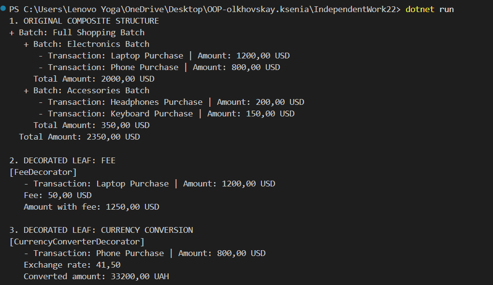
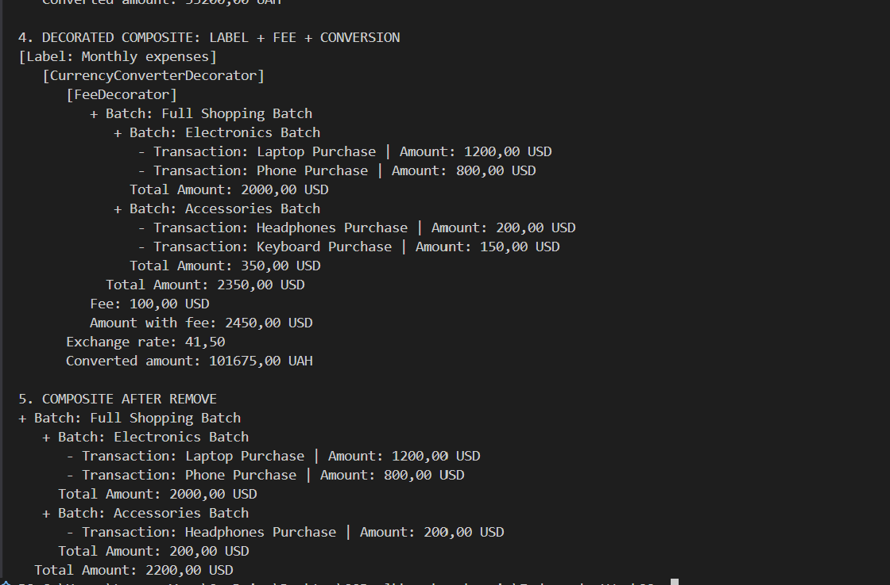

# Самостійна робота No22

## Тема

Composite + Decorator: реалізація та форматування.

## Варіант 12

Сценарій: фінансові транзакції.

- IComponent: спільний інтерфейс з операціями GetAmount() та Display().
- SingleTransaction: leaf-елемент, окрема фінансова транзакція з описом і сумою.
- BatchTransaction: composite-елемент, група транзакцій або інших груп транзакцій.
- TransactionDecorator: абстрактний decorator, який містить посилання на IComponent.
- FeeDecorator: додає комісію до суми.
- CurrencyConverterDecorator: імітує конвертацію суми в іншу валюту.
- TransactionLabelDecorator: додає текстову мітку до транзакції або групи.

## Як реалізовано Composite

BatchTransaction працює з колекцією IComponent, тому може містити як окремі SingleTransaction, так і інші BatchTransaction. Для клієнтського коду окрема транзакція і група мають однаковий інтерфейс:

```csharp
decimal amount = component.GetAmount();
component.Display();
```

Клас BatchTransaction має методи:

- Add(IComponent component) - додає дочірній елемент.
- Remove(IComponent component) - видаляє дочірній елемент.

## Як реалізовано Decorator

Усі decorators наслідуються від TransactionDecorator, який також реалізує IComponent. Завдяки цьому decorators можна застосовувати і до leaf, і до composite:

```csharp
IComponent decoratedBatch =
    new TransactionLabelDecorator(
        new CurrencyConverterDecorator(
            new FeeDecorator(fullBatch, 100),
            41.5m,
            "UAH"),
        "Monthly expenses");
```

## Демонстрація в Main

У Program.cs показано:

1. Створення кількох SingleTransaction.
2. Створення вкладеної composite-структури: Full Shopping Batch містить Electronics Batch та Accessories Batch.
3. Застосування FeeDecorator до окремої транзакції.
4. Застосування CurrencyConverterDecorator до окремої транзакції.
5. Комбінування decorators над composite: TransactionLabelDecorator + CurrencyConverterDecorator + FeeDecorator.
6. Використання Remove() для видалення елемента з composite.
## Демонстрація 




## Відповіді на контрольні питання

### 1.Поясніть патерн Composite. Як він дозволяє працювати з ієрархічними структурами?
 **Composite** дозволяє працювати з окремими об'єктами і групами об'єктів через один інтерфейс. У цій роботі SingleTransaction і BatchTransaction однаково реалізують IComponent.
### 2. Поясніть патерн Decorator. У чому його перевага над наслідуванням  ля розширення функціональності?
**Decorator** додає поведінку без зміни початкового класу. Це гнучкіше за наслідування, бо decorators можна комбінувати під час виконання.
### 3. Як можна комбінувати Composite та Decorator для створення складних та гнучких систем?
Composite та Decorator можна комбінувати так: спочатку створити ієрархію транзакцій, а потім обгорнути всю групу або окремий елемент декораторами.
### 4. Наведіть приклад, коли використання Composite або Decorator є більш доцільним, ніж інші підходи.
Composite доцільний для деревоподібних структур, наприклад груп транзакцій. Decorator доцільний, коли потрібно додавати комісію, конвертацію або мітку без зміни класів SingleTransaction і BatchTransaction.
