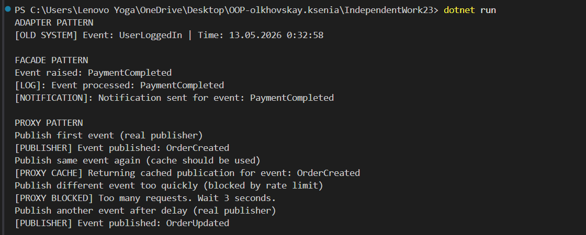

# IndependentWork23
### Тема: Adapter + Facade + Proxy
### Варіант 12 - Обробка подій

# Використані патерни

## Adapter

Патерн Adapter використовується для адаптації старого класу OldEventListener
до нового інтерфейсу IEventHandler.

### Основні компоненти:
- IEventHandler - Target interface
- OldEventListener - Adaptee
- OldEventAdapter - Adapter

## Facade

Патерн Facade надає спрощений інтерфейс для роботи з підсистемою обробки подій.

### Підсистема:
- EventSource
- Logger
- Notifier

### Facade:
- EventProcessingFacade

## Proxy

Патерн Proxy контролює доступ до публікації подій, реалізує rate limiting та кешування повторних викликів.

### Основні компоненти:
- IEventPublisher - Subject
- RealEventPublisher - Real Subject
- RateLimitEventPublisherProxy - Proxy
# Демонстрація роботи



## Adapter

Старий клас OldEventListener 
має несумісний метод:

```csharp
OnEvent(EventData data)
```
Adapter перетворює його на:
```csharp
HandleEvent(string eventMessage)
```

## Facade
EventProcessingFacade спрощує виклики підсистем:
- створення події,
- логування,
- надсилання сповіщень.

Клієнт працює лише з одним методом: HandleEvent()

## Proxy

RateLimitEventPublisherProxy контролює частоту публікації подій та кешує останні результати для повторних викликів.

Якщо запити надходять занадто швидко,
Proxy блокує виклик.

Якщо подія повторюється в межах проміжку кешу,
Proxy повертає кешовану відповідь без звернення до реального публішера.


## Відповіді на контрольні питання

### 1. Поясніть патерн Adapter. Коли його слід використовувати?
Adapter - це структурний патерн проєктування, який дозволяє
об’єктам із несумісними інтерфейсами працювати разом.

Основна ідея патерна полягає в тому, щоб створити спеціальний
клас-посередник, який перетворює один інтерфейс в інший,
очікуваний клієнтом.

Adapter доцільно використовувати у випадках:
- інтеграції legacy-коду;
- підключення сторонніх бібліотек;
- сумісності старих і нових компонентів системи;
- поступового оновлення архітектури застосунку.

У с/р 23 OldEventAdapter
адаптує старий клас OldEventListener
до нового інтерфейсу IEventHandler.
### 2. Поясніть патерн Facade. Як він спрощує роботу зі складними підсистемами?
Facade - це структурний патерн,
який надає єдиний спрощений інтерфейс
для роботи зі складною підсистемою.

Замість взаємодії з багатьма класами,
клієнт працює лише з одним Facade-об’єктом.

Переваги Facade:
- зменшення складності коду;
- приховування внутрішньої логіки системи;
- зниження зв’язності між компонентами;
- покращення читабельності та підтримуваності коду.

У с/р 23 EventProcessingFacade
об’єднує роботу:
- EventSource,
- Logger,
- Notifier.

Клієнту достатньо викликати лише один метод:
HandleEvent().
### 3. Поясніть патерн Proxy. Наведіть приклади різних типів Proxy (Virtual, Protection, Logging).
Proxy - це структурний патерн,
який створює об’єкт-посередник
для контролю доступу до іншого об’єкта.

Proxy може:
- обмежувати доступ;
- виконувати логування;
- кешувати дані;
- реалізовувати ледаче завантаження.

Типи Proxy:
- Virtual Proxy - ледаче створення об’єкта;
- Protection Proxy - контроль доступу;
- Logging Proxy - журналювання;
- Cache Proxy - кешування результатів.

У роботі використано
RateLimitEventPublisherProxy,
який обмежує частоту викликів.

### 4. У чому полягає ключова відмінність між Adapter, Facade та Proxy?
Adapter використовується для того,
щоб зробити несумісні інтерфейси сумісними
та дозволити різним класам працювати разом.

Facade використовується для спрощення роботи
зі складною системою,
об’єднуючи декілька компонентів
в один зручний інтерфейс.

Proxy використовується для контролю доступу
до реального об’єкта
та може додавати додаткову функціональність,
наприклад кешування, логування або обмеження доступу.