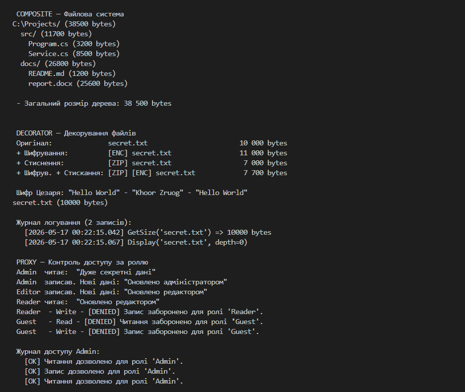
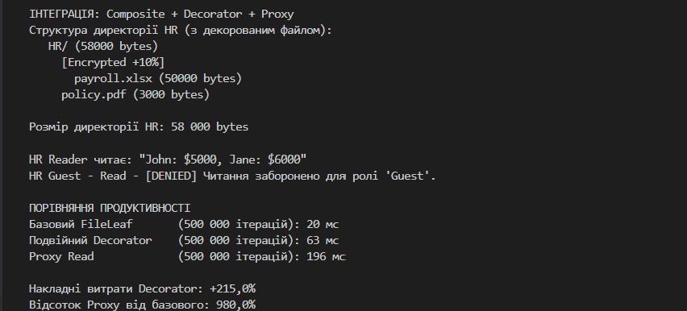
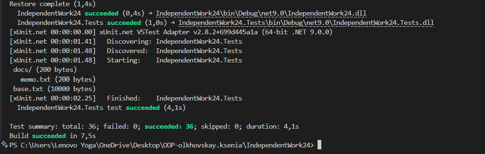

# IndependentWork24 — Інтеграція структурних патернів

## Мета
Інтегрувати кілька структурних патернів в одному рішенні, написати тести та виконати
базову оцінку продуктивності/компромісів.

## Які патерни інтегровані
- Composite
  - Інтерфейс: `IFileSystemComponent`.
  - Лист: `FileLeaf` (файл з розміром та вмістом).
  - Компонент-контейнер: `DirectoryComposite` — рекурсивно сумує розміри дочірніх елементів і відображає дерево.
  - Переваги: уніфікований інтерфейс для роботи з окремими елементами та композиціями; розрахунок метаданих (наприклад, загальний розмір) виконується рекурсивно без перевірок типів.
  - Компроміси: операції, які потребують специфічної логіки (наприклад, оновлення вмісту файлу), вимагають доступу до конкретних класів (`FileLeaf`) або додаткових методів.

- Decorator
  - Базовий клас: `FileDecoratorBase` (зберігає посилання на `IFileSystemComponent`).
  - Реалізації: `EncryptionDecorator`, `CompressionDecorator`, `LoggingDecorator`.
  - Роль: динамічне додавання поведінки (зміна `Name`, `Size`, логування викликів, тощо) без зміни початкових класів.
  - Composite - Decorator: декоратори працюють прозоро з `IFileSystemComponent`, тож вони легко вбудовуються у Composite-дерево - дерево не знає, що його дочірні вузли зовсім або частково декоровані. Важливо: порядок декораторів впливає на поведінку (наприклад, шифрування перед стисканням дає інший результат, ніж навпаки).
  - Компроміси: додаткові виклики/обгортки впливають на продуктивність і змінюють видимі атрибути (`Name`, `Size`); потрібно уважно підходити до округлень і точності (реалізовано через `Math.Round(..., MidpointRounding.AwayFromZero)` для стабільності результатів).

- Proxy
  - Інтерфейс/реалізація: `IFileAccess`, `RealFileAccess`, `FileAccessProxy`.
  - Тип проксі: Protection Proxy — контролює права доступу за ролями (`UserRole`) і веде аудит-лог.
  - Роль у інтеграції: Proxy контролює доступ до реального об'єкта (`RealFileAccess`), може використовуватись разом із Composite/Decorator (наприклад, захищати доступ до вмісту файлу, який може бути декорований у дереві).
  - Компроміси: централізація авторизації спрощує безпеку, але додає незначні накладні витрати при кожному виклику (перевірка ролі і запис у журнал).

## Що перевіряють тести
Сукупність тестів знаходиться у проекті `IndependentWork24.Tests` і включає:
- Тести `Composite`:
  - Порожні директорії мають розмір 0.
  - Розмір директорії = сума розмірів дочірніх елементів.
  - Рекурсивні директорії коректно сумуються.
  - Видалення дочірніх елементів працює.

- Тести `Decorator`:
  - `EncryptionDecorator`: +10% до розміру і зміна імені (`[ENC]`).
  - `CompressionDecorator`: -30% до розміру і зміна імені (`[ZIP]`).
  - Ланцюги декораторів  - перевірка комбінованого ефекту.
  - `LoggingDecorator`: фіксує звернення до `Size` та `Display`, має функції очистки журналу.
  - Негативні та граничні кейси: `null` у конструкторі декоратора, шифрування/дешифрування порожнього рядка.

- Тести `Proxy`:
  - Права доступу для ролей (`Admin`, `Editor`, `Reader`, `Guest`).
  - Журналювання успішних і відмовних операцій.
  - Граничні кейси: `null` для `RealFileAccess`, перевірка що `Write(null)` кидає `ArgumentNullException`.

- Інтеграційні тести (Composite + Decorator + Proxy):
  - Директорія з декорованим файлом має коректний сумарний розмір.
  - Composite з ланцюгом декораторів дає очікуваний результат.
  - Повний сценарій: одночасне використання Composite, Decorator і Proxy (чтення/запис під різними ролями).
  - Логування і аудит в інтеграційному сценарії - перевірка ланцюжка подій.

Усього: 36 тестів (усі проходять).

## Оцінка продуктивності та практичні висновки
### Як вимірюється
- У `Program.cs` використовується `Stopwatch` та цикл з `Iterations` (за замовчуванням 500_000 ітерацій).
- Вимірюються три сценарії:
  1. Базовий `FileLeaf.Size` (еталон).
  2. Декорований сценарій (наприклад, `CompressionDecorator(new EncryptionDecorator(file))`).
  3. `Proxy.Read()` (читає вміст через проксі з аудитом).
- Результати виводяться у вигляді мілісекунд та обчислюється відсоткове перевищення накладних витрат.

### Практичні висновки 
1. Decorator дає високу гнучкість: можна динамічно комбінувати поведінки (шифрування, стиснення, логування) без зміни `FileLeaf` або `DirectoryComposite`. Вартість: множинні обгортки додають невелику накладну роботу при кожному виклику властивостей/методів; у сценаріях з велику кількістю викликів варто кешувати результат або зменшити частоту обчислень.

2. Порядок декораторів критичний: наприклад, `Encrypt-Compress` і `Compress-Encrypt` дають різні розміри і результати; тому дизайн повинен явно визначати порядок обробки аспектів.

3. Proxy (Protection) забезпечує централізовану авторизацію та аудит з мінімальними витратами (перевірка enum-ролі і запис у журнал). Рекомендація: використовувати `Proxy` для контролю зовнішнього доступу та аудиту, але уникати зайвих проксі в «гарячих» циклах (висока частота викликів), або забезпечувати легку перевірку/виключення логування у критичних сценаріях.
## Демонстрація

### Тести 

